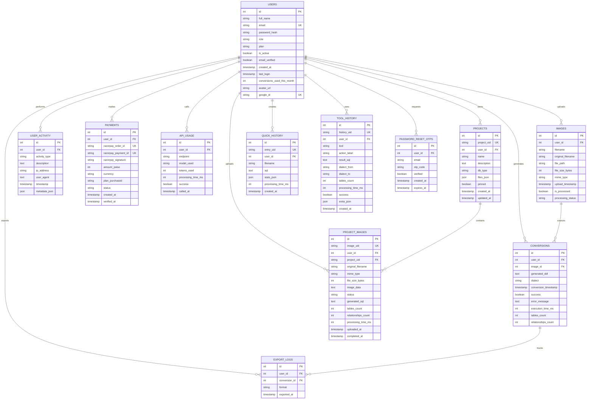

# Entity-Relationship (ER) Diagram
## SchemaLens Database Schema

**Version:** 1.0  
**Created:** September 2026  
**Database:** PostgreSQL  

---

## 1. High-Level ER Diagram

```
┌─────────────────────────────────────────────────────────────────────┐
│                         CORE ENTITIES                              │
└─────────────────────────────────────────────────────────────────────┘

                           ┌──────────┐
                           │  users   │
                           ├──────────┤
                           │ id (PK)  │
                           │ email    │
                           │ password │
                           │ role     │
                           │ plan     │
                           └────┬─────┘
                                │
                  ┌─────────────┼─────────────┐
                  │             │             │
                  │        (1:N) │             │
         ┌────────▼────┐  ┌──────▼──────┐  ┌─────▼────────┐
         │   images    │  │ conversions │  │   projects   │
         ├─────────────┤  ├─────────────┤  ├──────────────┤
         │ id (PK)     │  │ id (PK)     │  │ id (PK)      │
         │ user_id(FK) │  │ user_id(FK) │  │ user_id(FK)  │
         │ filename    │  │ image_id(FK)│  │ project_uid  │
         │ file_path   │  │ dialect     │  │ name         │
         │ status      │  │ generated.. │  └──────────────┘
         └─────────────┘  │ success     │
                          └─────────────┘

                          (Continues Below)
```

---

## 2. Complete ER Diagram (Mermaid Syntax)



---

## 3. Relationship Matrix

| From | To | Cardinality | Type | Action |
|------|----|-----------  |------|--------|
| users | images | 1:N | FK | CASCADE DELETE |
| users | conversions | 1:N | FK | CASCADE DELETE |
| users | user_activity | 1:N | FK | CASCADE DELETE |
| users | payments | 1:N | FK | CASCADE DELETE |
| users | api_usage | 1:N | FK | CASCADE DELETE |
| users | export_logs | 1:N | FK | CASCADE DELETE |
| users | projects | 1:N | FK | CASCADE DELETE |
| users | quick_history | 1:N | FK | CASCADE DELETE |
| users | tool_history | 1:N | FK | CASCADE DELETE |
| users | password_reset_otps | 1:N | FK | CASCADE DELETE |
| users | project_images | 1:N | FK | CASCADE DELETE |
| images | conversions | 1:N | FK | CASCADE DELETE |
| projects | project_images | 1:N | FK | CASCADE DELETE |
| conversions | export_logs | 1:N | FK | SET NULL |

---

## 4. Cardinality Explanations

### 1:N (One-to-Many) Relationships

**USERS : IMAGES = 1:N**
- One user can upload many ER diagram images
- Each image belongs to exactly one user
- When user is deleted, all their images are deleted

**USERS : CONVERSIONS = 1:N**
- One user can generate many SQL conversions
- Each conversion belongs to exactly one user
- Multiple conversions can be from the same image

**USERS : PROJECTS = 1:N**
- One user owns many projects
- Each project is owned by one user
- Projects organize conversions and files

**IMAGES : CONVERSIONS = 1:N**
- One image can be converted multiple times
- Each conversion is derived from one image (nullable)
- Allows comparing different dialect outputs from same diagram

---

## 5. Attribute Data Types & Constraints

### Text Attributes

```
VARCHAR(n)      - Fixed max length
  email         - 255 chars (RFC 5321 standard)
  filename      - 255 chars (filesystem compat)
  
TEXT            - Large text field
  generated_ddl - Unlimited SQL content
  description   - Project/image descriptions
```

### Numeric Attributes

```
SERIAL          - Auto-incrementing integer
  id            - Primary key in all tables
  
INTEGER         - 32-bit integer
  file_size_bytes - File size in bytes
  tokens_used   - AI token consumption
  tables_count  - Schema table count
  
BIGINT          - 64-bit integer (future use)
```

### Boolean Attributes

```
BOOLEAN         - True/False
  is_active     - Account status
  success       - Operation success flag
  verified      - Email/OTP verification
```

### Temporal Attributes

```
TIMESTAMP       - Date and time
  created_at    - Record creation time
  updated_at    - Last modification time
  expires_at    - Expiration timestamp (OTP)
  
With defaults:
  DEFAULT CURRENT_TIMESTAMP
  DEFAULT NOW()
```

### Structured Attributes

```
JSON/JSONB      - Flexible structured data
  metadata_json - Extra activity metadata
  stats_json    - Conversion statistics
  files_json    - Project file list
```

---

## 6. Unique Constraints

| Table | Column(s) | Purpose |
|-------|-----------|---------|
| users | email | Prevent duplicate registrations |
| users | google_id | Unique Google identity |
| projects | project_uid | Universally unique identifier |
| quick_history | entry_uid | Unique conversion entry |
| tool_history | history_uid | Unique tool usage entry |
| project_images | image_uid | Unique image identifier |
| payments | razorpay_order_id | Razorpay order uniqueness |
| payments | razorpay_payment_id | Razorpay payment uniqueness |

---

## 7. Primary Key Strategy

### Surrogate Keys (Artificial)

All tables use auto-incrementing SERIAL integers as primary keys:

```sql
id SERIAL PRIMARY KEY
```

**Advantages:**
- Small storage footprint
- Fast joins
- No business logic dependencies
- Easy to reference

**Implementation:**
```sql
CREATE TABLE users (
    id SERIAL PRIMARY KEY,
    ...
);

-- Insert
INSERT INTO users (full_name, email, ...) 
VALUES ('John Doe', 'john@example.com', ...);
-- id automatically assigned (1, 2, 3, ...)
```

---

## 8. Foreign Key Strategy

### Referential Integrity

All foreign key relationships use explicit FK constraints with cascade delete:

```sql
CREATE TABLE images (
    id SERIAL PRIMARY KEY,
    user_id INTEGER NOT NULL REFERENCES users(id) ON DELETE CASCADE,
    ...
);
```

**Cascade Delete Behavior:**
- When user is deleted, all images are deleted
- Prevents orphaned records
- Maintains data integrity

**Exception:**
```sql
-- Export logs use SET NULL instead of CASCADE
conversion_id INTEGER REFERENCES conversions(id) ON DELETE SET NULL
```

---

## 9. Indexing for Query Performance

### Indexed Columns

```sql
-- Primary Keys (automatic)
CREATE UNIQUE INDEX pk_users ON users(id);

-- Unique Constraints
CREATE UNIQUE INDEX uk_users_email ON users(email);
CREATE UNIQUE INDEX uk_users_google_id ON users(google_id);

-- Foreign Keys (query filtering)
CREATE INDEX idx_images_user_id ON images(user_id);
CREATE INDEX idx_conversions_user_id ON conversions(user_id);
CREATE INDEX idx_projects_user_id ON projects(user_id);

-- Temporal Queries (time-based filtering)
CREATE INDEX idx_conversions_timestamp ON conversions(conversion_timestamp DESC);
CREATE INDEX idx_user_activity_timestamp ON user_activity(timestamp DESC);
CREATE INDEX idx_quick_history_created_at ON quick_history(created_at DESC);

-- Combined Indexes (multi-column queries)
CREATE INDEX idx_projects_user_project ON projects(user_id, project_uid);
```

---

## 10. Denormalization Considerations

### Denormalized Columns (By Design)

```
conversions.tables_count
  - Denormalized from generated_ddl
  - Reason: Quick stats display without parsing SQL
  - Trade-off: Storage vs. Performance
  
users.conversions_used_this_month
  - Denormalized counter
  - Reason: Subscription usage check without aggregation
  - Updated on each conversion creation
```

### When NOT to Denormalize

- Do not denormalize user profile info into conversions
- Do not duplicate payment data
- Maintain normalization where possible

---

## 11. Data Integrity Triggers (Future)

```sql
-- Example: Auto-update projects.updated_at
CREATE TRIGGER update_projects_timestamp
BEFORE UPDATE ON projects
FOR EACH ROW
EXECUTE FUNCTION update_timestamp();

-- Example: Enforce conversions_used_this_month limit
CREATE TRIGGER check_conversion_limit
BEFORE INSERT ON conversions
FOR EACH ROW
WHEN (SELECT plan FROM users WHERE id = NEW.user_id) = 'free'
EXECUTE FUNCTION check_free_plan_limit();
```

---

## 12. Sample Queries

### Join Examples

```sql
-- User's conversion history
SELECT 
  u.full_name, c.id, c.dialect, c.success, c.conversion_timestamp
FROM users u
JOIN conversions c ON u.id = c.user_id
WHERE u.id = 1
ORDER BY c.conversion_timestamp DESC;

-- Image processing status
SELECT 
  u.full_name, i.original_filename, i.processing_status, 
  COUNT(c.id) as conversions
FROM users u
LEFT JOIN images i ON u.id = i.user_id
LEFT JOIN conversions c ON i.id = c.image_id
WHERE u.id = 1
GROUP BY u.id, i.id, i.original_filename, i.processing_status;

-- Project files and their conversions
SELECT 
  p.name, pi.original_filename, pi.status, 
  pi.tables_count, pi.relationships_count
FROM projects p
LEFT JOIN project_images pi ON p.project_uid = pi.project_uid
WHERE p.user_id = 1
ORDER BY p.created_at DESC, pi.uploaded_at DESC;
```

---

## 13. Performance Characteristics

### Table Sizes (Estimated)

| Table | Avg Rows (1000 users) | Size |
|-------|---------------------|----|
| users | 1,000 | ~100 KB |
| images | 5,000 | ~500 KB |
| conversions | 50,000 | ~10 MB |
| user_activity | 100,000 | ~5 MB |
| payments | 10,000 | ~1 MB |
| projects | 10,000 | ~1 MB |
| quick_history | 30,000 | ~50 MB |
| **TOTAL** | | **~70 MB** |

### Growth Projections

- Per user/month: ~50 KB (activity, conversions)
- Per 10K users: ~500 MB
- Per 100K users: ~5 GB
- Archive after 12 months

---

## 14. Migration Scenarios

### Migrate from Legacy System

```sql
-- Copy users
INSERT INTO users (full_name, email, password_hash, ...)
SELECT name, email, password, ... FROM legacy_users;

-- Copy conversions
INSERT INTO conversions (user_id, generated_ddl, dialect, ...)
SELECT NEW_USER_ID, sql, 'postgresql', ... FROM legacy_conversions;
```

### Schema Evolution

- Add non-null column with DEFAULT
- Add optional column as NULL
- Never alter existing primary keys
- Use migrations for schema changes

---

**Document End**
